# PCE Nigeria Website — "Website vs. Studio" Content Display Feedback

**Source feedback:** client doc `website and studio feedback.docx`, received September 11, 2026 — 6 numbered problems, each with the client's own annotated screenshot (red boxes mark the specific elements in question).
**Audience:** Antigravity agent working directly in `Projects/pce` (Next.js 16 / React 19, Sanity Studio embedded at `/studio`).
**What "Website vs. Studio" means:** the client is comparing the **live site** (`pcenigeria.com`) against **Sanity Studio**, the CMS editor they use to manage content. Every problem below is the client noticing that something visible on the live page has no matching, editable content in Studio.
**Method:** rather than just transcribing the docx, each problem was traced against the actual component code in this repo to confirm *why* Studio can't show it. This builds directly on the findings already recorded in [`pce-content-seeding-audit.md`](./pce-content-seeding-audit.md) (same folder) — several items below are the client independently confirming, with screenshots, issues that audit had already flagged from the code side. Screenshots referenced below are in `./website-studio-feedback-images/`.

---

## Summary — what's actually going on

Every problem the client reported except #1 has the same root cause: **the section simply isn't wired to Sanity at all.** These aren't cases of an editor forgetting to fill in a field — the React components render hardcoded local arrays/strings and never read a Studio-sourced prop for that content, so there is no field in Studio to fill in, empty or otherwise. That matches what the client is describing exactly: the content is real and shows on the live site, but has nothing to click on in Studio.

Problem 1 is different — it's a live-site rendering bug, not a Studio/CMS issue, and has a one-line fix.

| # | Area | Root cause found in code | Fix type |
|---|---|---|---|
| 1 | Capabilities — "Our Approach" | Gallery thumbnail strip re-renders `gallery.items[0]`, which is also used as the big hero photo | Small code fix |
| 2 | Capabilities — "How We Work" | `<HowWeWork />` rendered with zero props; no Sanity field exists for this section at all | New schema + wiring |
| 3 | Projects — hero carousel | `PROJECTS_HERO_SLIDES` hardcoded in-component; never reads `sanityPage` | New schema + wiring |
| 4 | Projects — filter tabs / country tags | `tabs` array hardcoded in-component; never reads `sanityPage` | New schema + wiring |
| 5 | Projects — "What Connects the Work" | `stats` (4 cards) hardcoded in-component; only the tagline/heading above it are wired | New schema + wiring |
| 6 | Products — full page body | 6 of 7 non-hero section components (`ProductsAbout`, `StratumGuide`, `PerformanceMatrix` table rows, `HddCaseStudies`, `StockLogistics`, `ProductsCta` contacts block) receive no props or only partial props from Sanity | New schema + wiring (largest item) |

---

## Problem 0 — Our Company: Safety and Quality

> Client's note: *"Our company — Safety and Quality — 1 quality, 2 environmental care, 3 standard and certification — no photos shown in studio."*

No screenshot was attached to this note in the docx (it reads as a general heads-up rather than one of the 6 numbered problems). It lines up with what the seeding audit already found: the entire Safety, Quality & Responsibility page (`/safety-quality-responsibility`) — hero, safety, quality, environmental-care, certification, our-future — is running entirely on hardcoded fallback text and has no seeded (or possibly no wired) images in Studio. Treat this as confirmation of that existing finding rather than a new one; no additional code tracing was done here since there's no screenshot to anchor it to a specific component. Worth a pass alongside Problem 6, since it's the same "whole page not wired" pattern.

---

## Problem 1 — Website: Capabilities "Our Approach" — duplicate photo

> Client's note: *"Website: Capabilities — our approach, same picture here, delete the smaller one."*

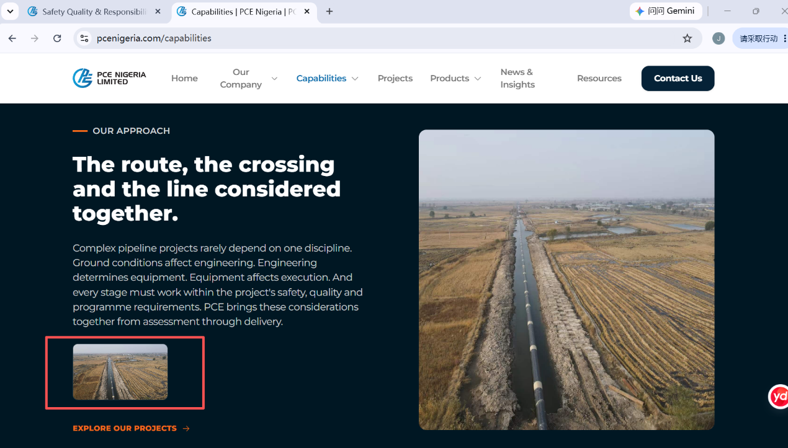

This is on the **live website itself** (not a Studio issue) — a small thumbnail directly under the "Our Approach" paragraph shows the exact same photo as the large image on the right.

**Root cause (confirmed in code):** `features/capabilities/components/our-approach.tsx`
- Line 45: the large hero image uses `section.gallery.items[0].src`.
- Lines ~93–104: a separate "Section Photo Gallery" block renders **every** item in `section.gallery.items` (including index 0 again) as a small thumbnail.

Because the Studio gallery for this section currently has only one photo, that one photo renders twice: once as the big image, once as the small duplicate the client circled.

**Fix:** in the gallery-thumbnail block (`features/capabilities/components/our-approach.tsx`, the `.map()` over `section.gallery.items`), either:
- skip index 0 (`section.gallery.items.slice(1).map(...)`), since it's already shown as the hero image, or
- hide the whole thumbnail strip when there's only 1 item (`section.gallery.items.length > 1 && ...`).

Either resolves it without needing the client to remove anything in Studio.

---

## Problem 2 — Studio: Capabilities "How We Work" — five photos not shown

> Client's note: *"Studio: Capabilities — how we work, five photos are not shown in studio."*

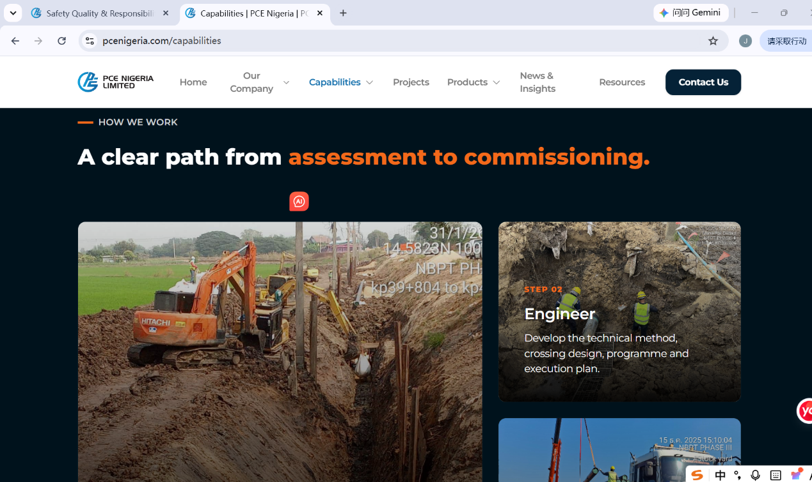

This confirms a finding already in `pce-content-seeding-audit.md`: the "How We Work" 5-step section (Understand → Engineer → Prepare → Deliver → Verify) on `/capabilities` is rendered by `<HowWeWork />` in `features/capabilities/pages/capabilities-page.tsx`, and that component is called **with zero props**. There is no field anywhere in the `capabilitiesPage` Sanity schema for this section's text or its 5 images — it's not that the field is empty, there is no field. The client literally cannot touch this section from Studio, which is exactly what they're reporting.

**Fix:** add a `howWeWorkSection` (or similarly named) object to the `capabilitiesPage` schema — 5 steps, each with title/description/image — and update `features/capabilities/components/how-we-work.tsx` to accept and render it (falling back to the current hardcoded 5 steps), then pass `sanityPage?.howWeWorkSection` into it from `capabilities-page.tsx`.

---

## Problem 3 — Studio: Projects — seven hero-carousel photos not shown

> Client's note: *"Studio: projects — the seven photos don't show in studio."*

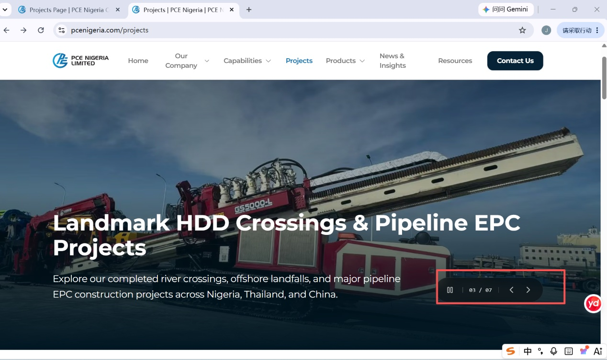

This is the auto-advancing hero photo carousel at the top of `/projects` (the "03 / 07" counter visible in the screenshot).

**Root cause (confirmed in code):** `features/projects/components/projects-home.tsx`, line 11 — `const PROJECTS_HERO_SLIDES = [...]` is a hardcoded array of 7 slides. The component takes a `sanityPage` prop (used for `heroHeadline`/`heroSubtext` only, lines 90/103) but the slide images themselves never reference `sanityPage` at all — same pattern as Problem 2.

**Fix:** add a `heroGallery` (or reuse the existing `gallery` object type already used elsewhere in the schema, per `pce-sanity-cms-scope.md` §3.1) field to `projectsPage`, and swap `PROJECTS_HERO_SLIDES` for `sanityPage?.heroGallery?.items` with the current array kept as the fallback.

---

## Problem 4 — Studio: Projects — filter tabs / country tags not shown

> Client's note: *"Studio: projects — items in the red rectangle don't show in studio."*

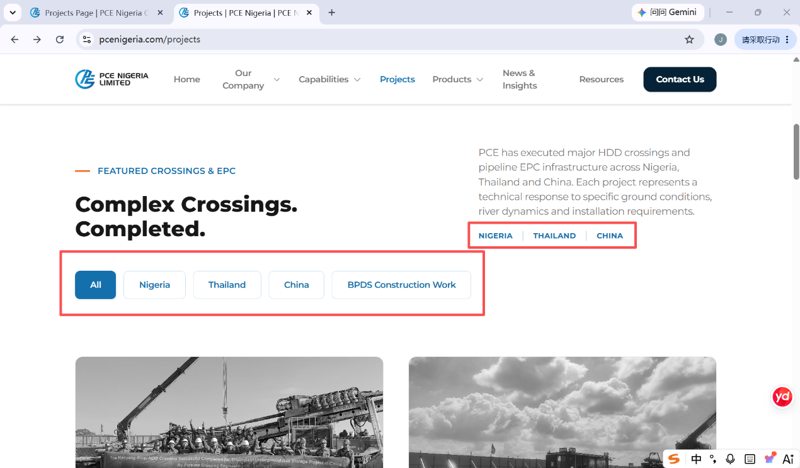

Two elements are boxed in the client's screenshot: the "Nigeria | Thailand | China" badge near the top, and the All / Nigeria / Thailand / China / BPDS Construction Work filter buttons below it.

**Root cause (confirmed in code):** `features/projects/components/featured-projects.tsx`, line 140 — the `tabs: TabItem[]` array (names, descriptions, the BPDS "coming soon" subtext) is hardcoded directly in the component. It has no connection to `sanityPage` or any Sanity document. The individual project cards themselves are well-seeded (per the earlier audit), but the tab/filter chrome around them is not editable at all.

**Fix:** add a `projectTabs` array field to `projectsPage` (id/name/description/subtext per tab) and read it in `featured-projects.tsx` instead of the hardcoded `tabs` array, keeping the current 5 tabs as fallback. Since the country badge near the top is just static decorative text in the same file, it can either stay static or pull from the same field — worth asking the client if they actually want to edit tab labels often, or if this is lower priority than 2/3/5/6.

---

## Problem 5 — Studio: Projects "What Connects the Work" — four cards not shown

> Client's note: *"Studio: projects — what connects the work. Specialist Engineer, Appropriate Equipment, Coordinated Execution, Experience Carried Forward. These four bullets with pictures don't show in studio."*

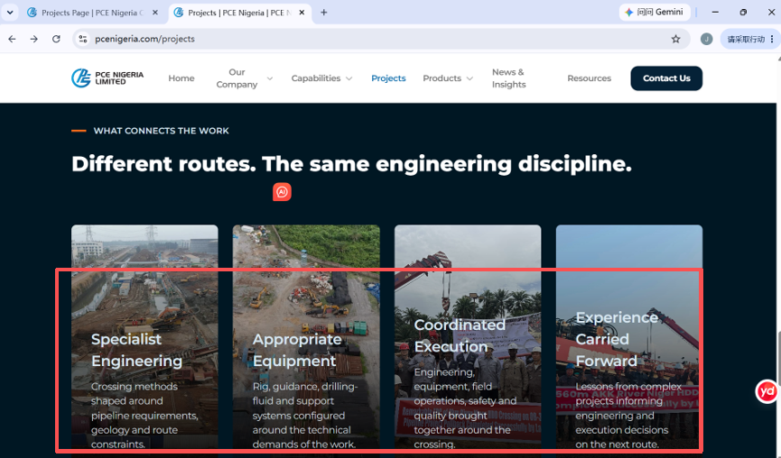

**Root cause (confirmed in code):** `features/projects/components/what-works.tsx`. The section's tagline and heading **are** wired (`sanityPage?.gridSection?.tagline` / `.heading`, lines 10–11) — but the 4 cards themselves (`const stats = [...]`, lines 13–33: title, description, and background image for each of Specialist Engineering / Appropriate Equipment / Coordinated Execution / Experience Carried Forward) are a hardcoded local array never touched by `sanityPage`. So the section heading is editable but none of its actual content is — likely why the client sees the heading as fine but the four cards as untouchable.

**Fix:** extend `projectsPage`'s `gridSection` schema object with an `items` array (title/description/image per card, 4 entries) and swap the hardcoded `stats` array for `sanityPage?.gridSection?.items`, current values as fallback.

---

## Problem 6 — Studio: Products — Product Overview content not shown

> Client's note: *"Studio: products — product overview. Contents in the below pictures don't show in studio."*

This is the largest item — the client attached 10 screenshots covering nearly the entire `/products` page body. Cross-checking `features/products/pages/products-page.tsx` (which explicitly lists every section and what prop, if any, it receives) shows why: of the 7 sections below the hero, only 3 receive any Sanity-sourced content, and even those 3 only get partial coverage.

```
<ProductsHero sanityPage={sanityPage} />                                          ✅ wired
<ProductCardsGrid sanityProducts={...} section={sanityPage?.catalogSection} />    ✅ wired
<ProductsAbout />                                                                  🔴 NO PROPS — fully hardcoded
<StratumGuide />                                                                   🔴 NO PROPS — fully hardcoded
<PerformanceMatrix section={sanityPage?.matrixSection} />                         ⚠️ heading/tagline only — table rows hardcoded
<HddCaseStudies />                                                                 🔴 NO PROPS — fully hardcoded
<StockLogistics section={sanityPage?.logisticsSection} />                         ⚠️ wired, seeding unconfirmed
<ProductsCta section={sanityPage?.ctaSection} />                                  ⚠️ CTA quote wired — contacts block hardcoded
```

Screenshot-by-screenshot:

**6a — "A Team Built on Drilling Fluid Expertise" (About Us) + "Quality Control & Testing" callout**
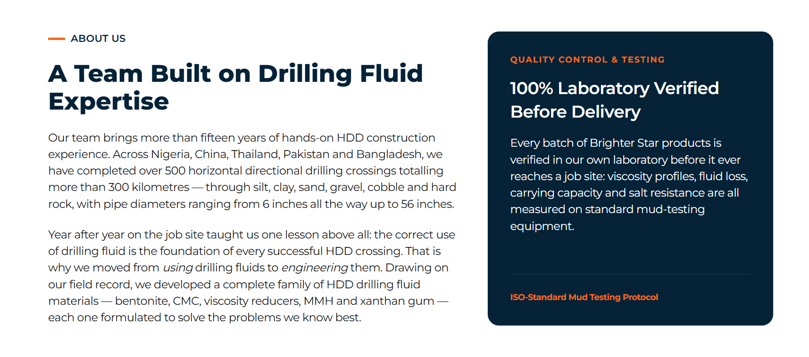
Component: `features/products/components/products-about.tsx`. Takes **no props at all** — every word is a hardcoded JSX literal. No Studio field exists for this block.

**6b — Stat bar (15+ Years / 500+ Crossings / 300+ km / 5 Countries / 6"–56")**
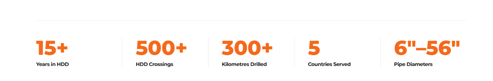
Same component (`products-about.tsx`) — also hardcoded, no props.

**6c/6d — "HDD Challenges & Recommended Mud Systems" (Know the Ground)**
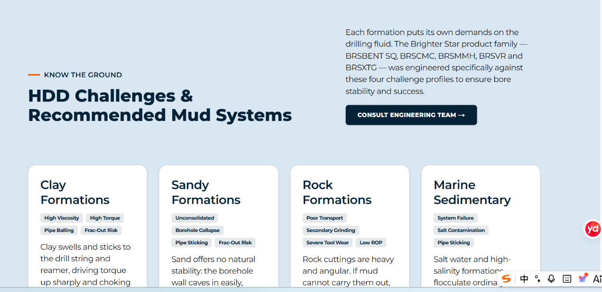
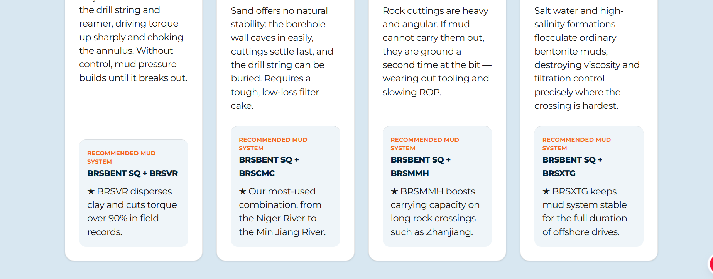
Component: `features/products/components/stratum-guide.tsx`. Takes **no props at all** — the 4 formation cards (Clay/Sandy/Rock/Marine Sedimentary), their challenge tags, and their recommended mud-system boxes are all hardcoded.

**6e — Performance Matrix comparison table**
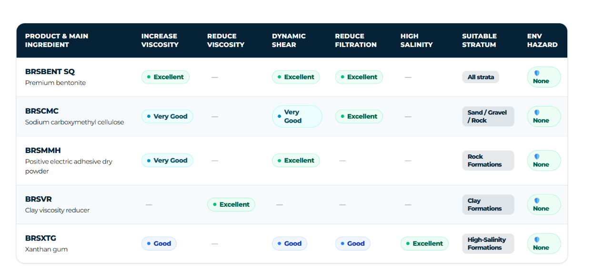
Component: `features/products/components/performance-matrix.tsx`. The tagline/heading/body **are** wired via `section={sanityPage?.matrixSection}`, but the actual `matrixData` array (the 5 product rows — BRSBENT SQ, BRSCMC, BRSMMH, BRSVR, BRSXTG — and every column value) is a hardcoded local constant, never read from `section`. The table's headline text could technically be edited in Studio today; its contents cannot.

**6f/6g — "Typical HDD Project Case Studies" (8 project cards)**
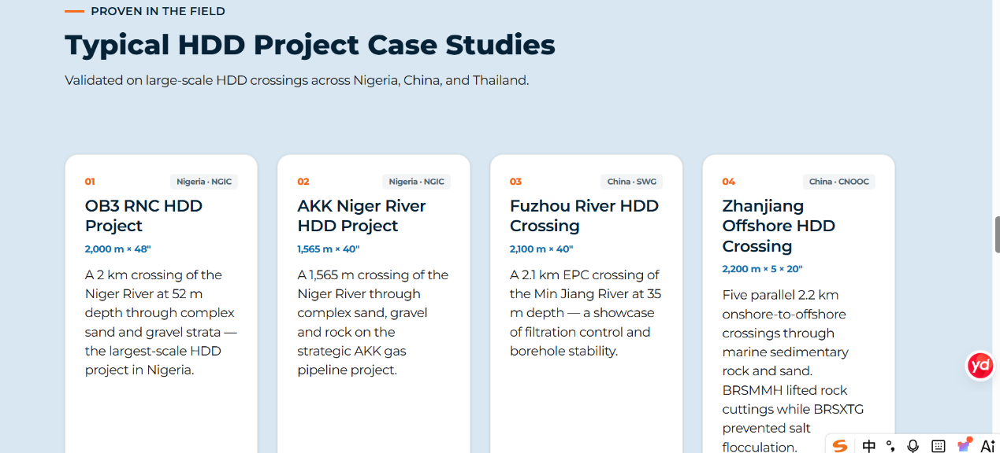
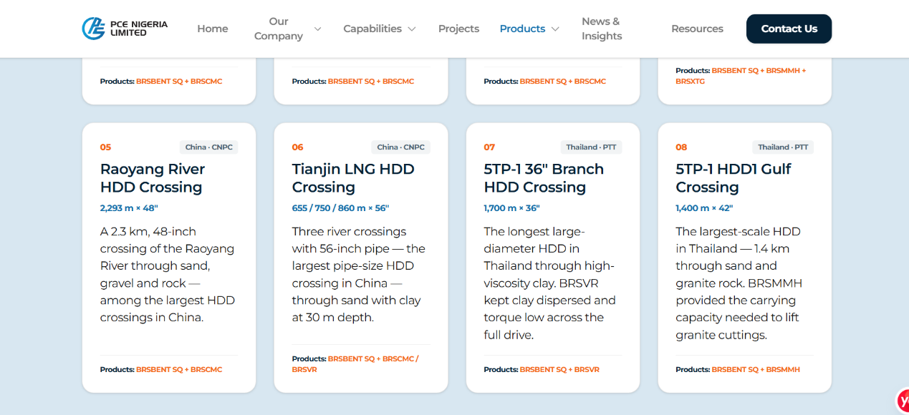
Component: `features/products/components/hdd-case-studies.tsx`. Takes **no props at all** — all 8 case study cards (OB3, AKK, Fuzhou, Zhanjiang, Raoyang River, Tianjin LNG, 5TP-1 ×2) are hardcoded.

**6h — "Immediate Rig Dispatch" stock & logistics callout**
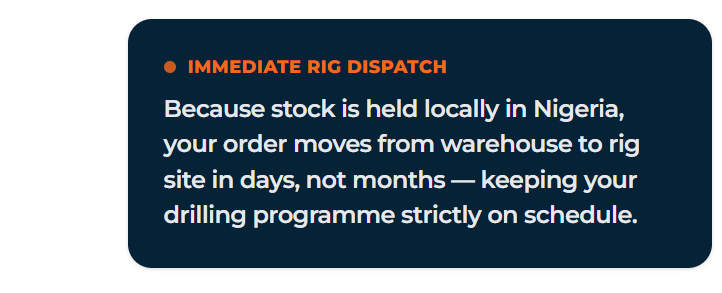
Component: `features/products/components/stock-logistics.tsx`. Receives `section={sanityPage?.logisticsSection}`, so this one is at least wired at the code level — if it's still showing as "not in Studio," the likely explanation is the same as several pages in the seeding audit: the field exists but the document/section is empty or unpublished. Worth checking directly in Studio before writing new schema for this one.

**6i — Product photo gallery (BRSBENT SQ / BRSCMC / BRSMMH / BRSVR / BRSXTG bags & jugs)**
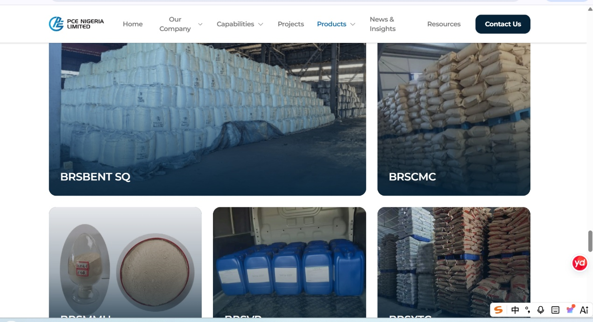
Component: `features/products/components/product-cards-grid.tsx`, which does receive `sanityProducts` and `section={sanityPage?.catalogSection}`. Same note as 6h — check whether `catalogSection`/the product documents are actually populated in Studio before assuming this needs new schema; it may just need content entered.

**6j — "Direct Sales & Engineering Contacts" + Abuja/Lagos office addresses**
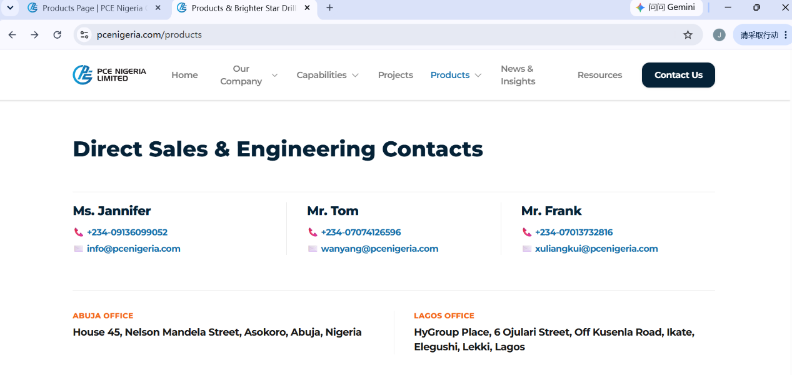
Component: `features/products/components/products-cta.tsx`. The closing CTA quote above this (tagline/heading/bullets/button) **is** wired via `section={sanityPage?.ctaSection}` — but the contacts block itself (Ms. Jannifer / Mr. Tom / Mr. Frank with phone/email, plus the two office addresses) is a literal hardcoded array inside the component (`[{ name: 'Ms. Jannifer', ... }, ...]`), never touched by `section`. No Studio field exists for staff contacts or office addresses on this page. Note: this same contact info is also hardcoded separately in `shared/components/layout/site-footer.tsx` and `features/contact/components/contact-details.tsx` — if this becomes a shared `contactPerson`/office-address schema object (as already proposed in `pce-sanity-cms-scope.md` §3.1), consider wiring all three locations from one Studio-managed source rather than three separate hardcoded copies that can drift out of sync.

**Recommended approach for Problem 6:** given how much of the Products page is unwired, treat `ProductsAbout`, `StratumGuide`, `HddCaseStudies`, and the `PerformanceMatrix` table rows / `ProductsCta` contacts block as one batch of schema work on `productsPage` (extending the `productsPage` singleton already scoped in `pce-sanity-cms-scope.md` §3.2), rather than 6 separate one-off fixes. Confirm `logisticsSection` and `catalogSection` seeding status directly in Studio first (6h/6i) since those may just need content, not new fields.

---

## Suggested sequencing for the agent

1. **Problem 1** first — it's a 1-line code fix on the live site with no schema/content dependency, highest value for lowest effort.
2. **Problems 2, 3, 5** — same pattern (Capabilities "How We Work", Projects hero carousel, Projects "What Connects the Work"), each needs one new schema object + one component update. Can be done together as they follow an identical recipe.
3. **Problem 6** — largest scope; do the "no props at all" components first (`ProductsAbout`, `StratumGuide`, `HddCaseStudies`, matrix table rows, CTA contacts block) since those definitely need new schema. Check 6h/6i in Studio before writing schema for them — they may already be wired and just empty.
4. **Problem 4** — lowest priority; it's editable-in-code-only chrome (tab labels) rather than missing content, worth doing but not urgent.
5. **Problem 0** — fold into whatever pass eventually covers the Safety, Quality & Responsibility page; it's a confirmation of a pre-existing finding, not new scope.
